# Document Information

**Document:** C4 Container Diagram  
**Project:** WorkSphere AI  
**Version:** 1.0  
**Status:** Draft  
**Author:** Oussama Ksantini  
**Last Updated:** 2026-07-11

---

# C4 Container Diagram

## Purpose

This diagram shows the major deployable containers that compose WorkSphere AI.

It presents:

- Client applications
- Platform infrastructure
- Backend services
- Databases
- Messaging
- External integrations

A container in the C4 model represents an application, service, database, or separately deployable runtime unit.

---

# Container Diagram

```mermaid
flowchart TB

    subgraph USERS["Users"]
        PLATFORM_OWNER["Platform Owner"]
        COMPANY_ADMIN["Company Administrator"]
        HR["HR / Recruiter"]
        MANAGER["Manager"]
        EMPLOYEE["Employee"]
        CANDIDATE["Candidate"]
    end

    subgraph CLIENTS["Client Applications"]
        ADMIN_PORTAL["Admin Portal<br/>React + TypeScript"]
        EMPLOYEE_PORTAL["Employee Portal<br/>React + TypeScript"]
        CANDIDATE_PORTAL["Candidate Portal<br/>React + TypeScript"]
    end

    subgraph PLATFORM["WorkSphere AI Platform"]

        GATEWAY["API Gateway<br/>Spring Cloud Gateway"]

        CONFIG["Configuration Service<br/>Spring Cloud Config Server"]

        DISCOVERY["Discovery Service<br/>Netflix Eureka"]

        IDENTITY["Identity Service<br/>Authentication, users,<br/>roles and permissions"]

        TALENT["Talent Service<br/>Jobs, candidates,<br/>applications and offers"]

        WORKFORCE["Workforce Service<br/>Companies, employees,<br/>teams and onboarding"]

        LEARNING["Learning Service<br/>Courses, quizzes,<br/>attempts and certificates"]

        ENGAGEMENT["Engagement Service<br/>Recognition, points,<br/>forum and notifications"]

        KAFKA["Apache Kafka<br/>Domain Events"]

        IDENTITY_DB[("identity_db<br/>PostgreSQL")]
        TALENT_DB[("talent_db<br/>PostgreSQL")]
        WORKFORCE_DB[("workforce_db<br/>PostgreSQL")]
        LEARNING_DB[("learning_db<br/>PostgreSQL")]
        ENGAGEMENT_DB[("engagement_db<br/>PostgreSQL")]
    end

    subgraph EXTERNAL["External Systems"]
        EMAIL["Email Provider"]
        STORAGE["AWS S3 / MinIO"]
        CALENDAR["Google / Microsoft Calendar"]
        AI_PROVIDER["AI Provider"]
        GITHUB["GitHub / GitLab"]
        COLLAB["Slack / Microsoft Teams"]
    end

    PLATFORM_OWNER --> ADMIN_PORTAL
    COMPANY_ADMIN --> ADMIN_PORTAL
    HR --> ADMIN_PORTAL
    MANAGER --> EMPLOYEE_PORTAL
    EMPLOYEE --> EMPLOYEE_PORTAL
    CANDIDATE --> CANDIDATE_PORTAL

    ADMIN_PORTAL --> GATEWAY
    EMPLOYEE_PORTAL --> GATEWAY
    CANDIDATE_PORTAL --> GATEWAY

    GATEWAY --> IDENTITY
    GATEWAY --> TALENT
    GATEWAY --> WORKFORCE
    GATEWAY --> LEARNING
    GATEWAY --> ENGAGEMENT

    CONFIG --> GATEWAY
    CONFIG --> DISCOVERY
    CONFIG --> IDENTITY
    CONFIG --> TALENT
    CONFIG --> WORKFORCE
    CONFIG --> LEARNING
    CONFIG --> ENGAGEMENT

    IDENTITY --> DISCOVERY
    TALENT --> DISCOVERY
    WORKFORCE --> DISCOVERY
    LEARNING --> DISCOVERY
    ENGAGEMENT --> DISCOVERY
    GATEWAY --> DISCOVERY

    IDENTITY --> IDENTITY_DB
    TALENT --> TALENT_DB
    WORKFORCE --> WORKFORCE_DB
    LEARNING --> LEARNING_DB
    ENGAGEMENT --> ENGAGEMENT_DB

    TALENT --> KAFKA
    WORKFORCE --> KAFKA
    LEARNING --> KAFKA
    ENGAGEMENT --> KAFKA
    IDENTITY --> KAFKA

    KAFKA --> TALENT
    KAFKA --> WORKFORCE
    KAFKA --> LEARNING
    KAFKA --> ENGAGEMENT

    IDENTITY --> EMAIL
    TALENT --> EMAIL
    ENGAGEMENT --> EMAIL

    TALENT --> STORAGE
    WORKFORCE --> STORAGE
    LEARNING --> STORAGE

    TALENT --> CALENDAR
    ENGAGEMENT --> CALENDAR

    TALENT --> AI_PROVIDER
    LEARNING --> AI_PROVIDER

    WORKFORCE --> GITHUB
    ENGAGEMENT --> COLLAB
```



---

# Client Applications

## Admin Portal

Used by:

- Platform Owner
- Company Administrator
- HR
- Recruiter

Main capabilities:

- Tenant administration
- Company configuration
- Recruitment
- Employee management
- Learning administration
- Analytics
- Roles and permissions

---

## Employee Portal

Used by:

- Managers
- Employees

Main capabilities:

- Employee profile
- Onboarding
- Learning and quizzes
- Recognition
- Forum
- Notifications
- Team activities

---

## Candidate Portal

Used by external candidates.

Main capabilities:

- Search jobs
- Create candidate profile
- Upload resume
- Apply for jobs
- View interview schedule
- Review and accept offers

---

# Platform Infrastructure

## API Gateway

The API Gateway is the public entry point for all frontend applications.

Responsibilities:

- Request routing
- Authentication checks
- CORS
- Rate limiting
- Correlation IDs
- Tenant context propagation
- Load balancing

Business logic must not be implemented inside the gateway.

---

## Configuration Service

Provides centralized configuration to all services.

Responsibilities:

- Shared configuration
- Environment-specific configuration
- Git-backed configuration
- Service startup configuration

Secrets must not be stored directly in the configuration repository.

---

## Discovery Service

Allows services to register and discover one another.

Responsibilities:

- Service registration
- Service lookup
- Instance discovery
- Load-balancing support

---

## Apache Kafka

Provides asynchronous communication between services.

Initial event examples:

- UserRegistered
- CandidateApplied
- InterviewScheduled
- OfferAccepted
- EmployeeCreated
- QuizCompleted
- CertificateIssued
- RecognitionGiven
- EmployeeOfMonthSelected

Kafka is planned after the first synchronous MVP services are working.

---

# Business Services

## Identity Service

Owns:

- User accounts
- Authentication
- Refresh tokens
- Roles
- Permissions
- Account security

Database:

```text
identity_db
```

---

## Talent Service

Owns:

- Candidate profiles
- Resumes
- Job openings
- Applications
- Interviews
- Feedback
- Offers

Database:

```text
talent_db
```

---

## Workforce Service

Owns:

- Companies
- Departments
- Teams
- Positions
- Employee profiles
- Manager assignments
- Onboarding
- Recognition scoring for the MVP

Database:

```text
workforce_db
```

---

## Learning Service

Owns:

- Learning paths
- Courses
- Quizzes
- Questions
- Attempts
- Certificates

Database:

```text
learning_db
```

---

## Engagement Service

Owns:

- Forum
- Posts
- Comments
- Announcements
- Recognition display
- In-app notifications
- Employee of the Month publication

Database:

```text
engagement_db
```

---

# Database Rules

Each service owns its database.

The following are prohibited:

- Shared database tables
- Direct SQL access to another service database
- Cross-service database joins
- Shared JPA entities

Cross-service information is exchanged through:

- REST APIs
- Kafka events

---

# External Systems

## Email Provider

Supports:

- Verification emails
- Password resets
- Invitations
- Interview reminders
- Offer notifications
- Certificate notifications

---

## Object Storage

AWS S3 will be used in production.

MinIO may be used locally.

Stored content includes:

- Resumes
- Employee documents
- Profile images
- Company logos
- Course files
- Certificates

---

## Calendar Providers

Future integrations include:

- Google Calendar
- Microsoft Outlook
- Google Meet
- Microsoft Teams meetings

---

## AI Provider

Future capabilities include:

- Resume analysis
- Candidate matching
- Interview question generation
- Quiz generation
- Learning recommendations
- Analytics summaries

---

# MVP Container Scope

The first implementation does not require every container shown in this diagram.

Initial foundation:

1. Configuration Service
2. Discovery Service
3. API Gateway
4. Identity Service
5. PostgreSQL
6. Docker Compose

Business services will then be added incrementally.

Kafka and external integrations remain visible in the target architecture but will be implemented later.

---

# Architecture Constraints

- Frontend applications access backend services only through the API Gateway.
- Services must register with the Discovery Service.
- Services receive non-secret configuration from the Config Server.
- Each business service owns its database.
- Business events use Kafka.
- Immediate request-response operations use REST.
- External integrations must be isolated behind application interfaces.
- Services must remain independently deployable.