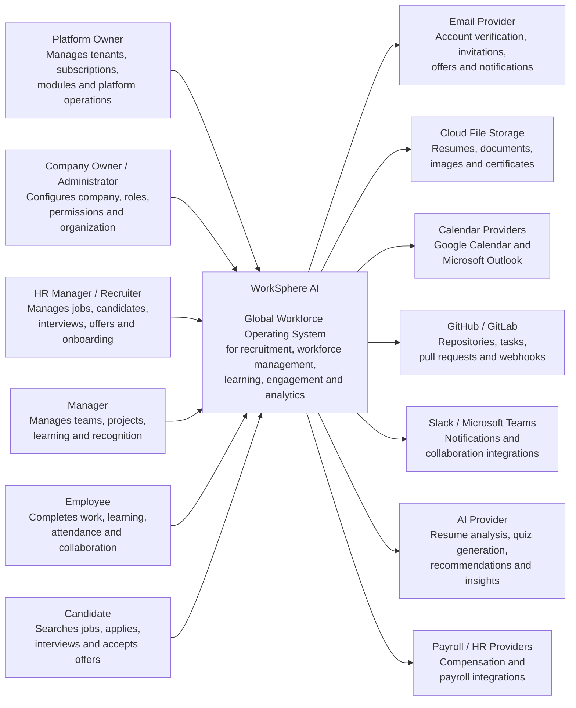

# Document Information

**Document:** C4 System Context Diagram  
**Project:** WorkSphere AI  
**Version:** 1.0  
**Status:** Draft  
**Author:** Oussama Ksantini  
**Last Updated:** 2026-07-11

---

# C4 System Context Diagram

## Purpose

This diagram shows WorkSphere AI at the highest level.

It identifies:

- Who uses the platform
- Which external systems interact with it
- The primary responsibilities of WorkSphere AI

It intentionally does not show individual microservices or databases.

---

## System Context

---

# Primary Actors

## Platform Owner

Operates the WorkSphere AI SaaS platform.

Responsibilities include:

- Tenant management
- Subscription management
- Module activation
- Platform monitoring
- Support and administration

---

## Company Owner or Administrator

Configures a company tenant.

Responsibilities include:

- Company settings
- Departments and teams
- Offices and positions
- Roles and permissions
- Module configuration
- Company branding

---

## HR Manager or Recruiter

Manages the talent lifecycle.

Responsibilities include:

- Job postings
- Candidate review
- Interviews
- Offers
- Hiring
- Employee onboarding

---

## Manager

Manages employees and team operations.

Responsibilities include:

- Team assignments
- Projects and tasks
- Learning progress
- Recognition
- Meetings
- Team analytics

---

## Employee

Uses WorkSphere AI during daily work.

Responsibilities include:

- Profile management
- Onboarding
- Learning and quizzes
- Projects and tasks
- Attendance
- Collaboration
- Recognition

---

## Candidate

Uses the public recruitment portal.

Responsibilities include:

- Candidate profile
- Resume upload
- Job applications
- Interview scheduling
- Offer acceptance

---

# External Systems

## Email Provider

Supports:

- Email verification
- Password reset
- Employee invitations
- Interview notifications
- Offer delivery
- Training reminders

---

## Cloud File Storage

Stores:

- Resumes
- Employee documents
- Company logos
- Profile images
- Course files
- Certificates

---

## Calendar Providers

Support:

- Interview scheduling
- Company meetings
- Training sessions
- Calendar synchronization
- Meeting invitations

---

## GitHub and GitLab

Support:

- Repository connections
- Pull request tracking
- Webhooks
- Task linking
- Development activity synchronization

---

## Slack and Microsoft Teams

Support:

- Company notifications
- Project updates
- Recognition announcements
- Collaboration workflows

---

## AI Provider

Supports:

- Resume analysis
- Candidate matching
- Quiz generation
- Interview preparation
- Learning recommendations
- Analytics summaries

---

## Payroll and HR Providers

Future integrations may support:

- Payroll export
- Compensation synchronization
- Benefits information
- Employee record synchronization

---

# System Boundary

WorkSphere AI owns:

- Authentication and authorization
- Tenant management
- Recruitment workflows
- Employee profiles
- Organization structure
- Learning and quizzes
- Recognition
- Engagement
- Internal business workflows

External providers remain responsible for their specialized capabilities, such as email delivery, cloud storage, payroll processing and third-party calendars.