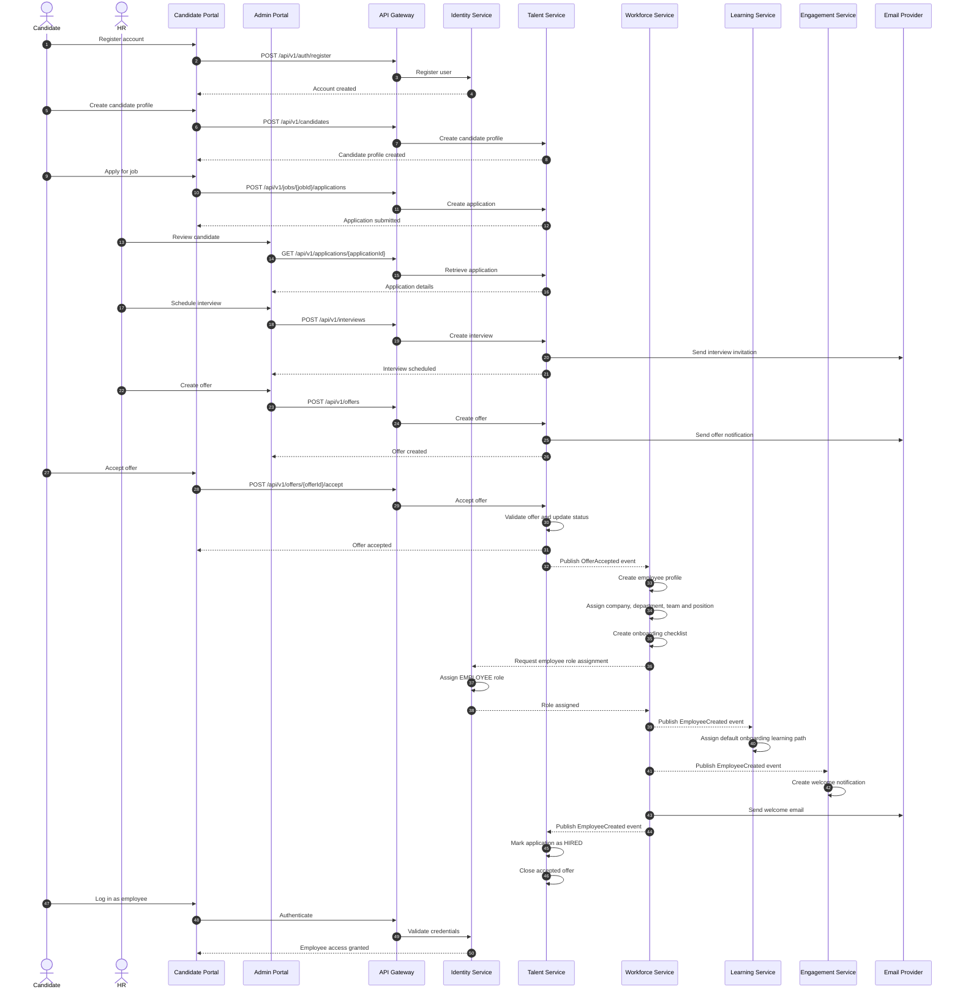

# Document Information

**Document:** Candidate-to-Employee Sequence  
**Project:** WorkSphere AI  
**Version:** 1.0  
**Status:** Draft  
**Author:** Oussama Ksantini  
**Last Updated:** 2026-07-11

---

# Candidate-to-Employee Sequence

## Purpose

This document describes the main workflow that converts a candidate into an employee after an offer is accepted.

This is the most important cross-service workflow in WorkSphere AI because it connects:

- Identity Service
- Talent Service
- Workforce Service
- Learning Service
- Engagement Service

---

# Main Actors

- Candidate
- HR or Recruiter
- Candidate Portal
- Admin Portal
- API Gateway
- Identity Service
- Talent Service
- Workforce Service
- Learning Service
- Engagement Service
- Email Provider

---

# Sequence Diagram



---

# Workflow Summary

## 1. Candidate Registration

The candidate creates a WorkSphere user account.

The Identity Service owns:

- Credentials
- Account status
- Roles
- Authentication

---

## 2. Candidate Profile

The Talent Service creates a candidate profile linked to the user ID.

The Talent Service does not store login credentials.

---

## 3. Job Application

The candidate applies for an internal job.

The Talent Service owns:

- Job
- Candidate profile
- Application
- Recruitment status

---

## 4. Interview

HR schedules one or more interviews.

The Talent Service records:

- Interview date and time
- Interviewers
- Meeting location or link
- Interview stage
- Feedback

---

## 5. Offer

HR creates an offer.

The candidate can:

- Accept
- Reject
- Request clarification
- Allow the offer to expire

---

## 6. Offer Acceptance

The Talent Service validates that:

- The offer exists.
- The offer belongs to the candidate.
- The offer is active.
- The offer has not expired.
- The application is still eligible.
- The job opening is still available.

The Talent Service then changes the offer status to `ACCEPTED`.

---

## 7. Employee Provisioning

The Talent Service publishes `OfferAccepted`.

The Workforce Service consumes the event and creates:

- Employee profile
- Employee number
- Company assignment
- Department assignment
- Team assignment
- Position assignment
- Manager assignment, when configured
- Onboarding checklist

---

## 8. Identity Update

The employee uses the same account that was created as a candidate.

The Identity Service assigns the required employee role and permissions.

No duplicate user account is created.

---

## 9. Learning Assignment

The Learning Service receives `EmployeeCreated`.

It assigns the company's default onboarding learning path, such as:

- Company policies
- Security awareness
- Role-specific training
- Required quizzes

---

## 10. Welcome Notification

The Engagement Service creates an in-app notification.

An email provider sends the welcome message.

---

## 11. Recruitment Completion

The Talent Service receives confirmation that the employee was created.

It then:

- Marks the application as `HIRED`
- Closes the accepted offer
- Updates job-opening statistics

---

# Main Events

```text
CandidateProfileCreated
ApplicationSubmitted
InterviewScheduled
OfferCreated
OfferAccepted
EmployeeCreated
EmployeeRoleAssigned
OnboardingStarted
LearningPathAssigned
WelcomeNotificationCreated
ApplicationHired
```

---

# Business Rules

- One accepted offer can create only one employee profile.
- The employee must keep the same user account used as a candidate.
- An expired offer cannot be accepted.
- A rejected offer cannot later be accepted without reactivation.
- The company, department, team and position must be valid.
- Employee creation must be idempotent.
- Duplicate `OfferAccepted` events must not create duplicate employees.
- The candidate must not receive employee permissions before employee provisioning succeeds.
- Every status transition must be audited.
- Tenant boundaries must be preserved throughout the workflow.

---

# Failure Scenarios

## Employee Creation Fails

The Workforce Service should:

- Retry transient failures
- Record the provisioning failure
- Avoid duplicate employee creation
- Notify HR if manual action is required

The Talent Service should keep the offer as accepted but mark employee provisioning as pending or failed.

---

## Role Assignment Fails

The employee profile may exist, but access remains incomplete.

The system should:

- Retry role assignment
- Mark account provisioning as pending
- Notify an administrator
- Prevent access to employee-only features until completed

---

## Learning Assignment Fails

Employee creation remains successful.

Learning assignment should retry independently.

The employee can still access the platform while the onboarding learning path is pending.

---

## Email Delivery Fails

The workflow must not be rolled back.

The notification should be retried or made available in-app.

---

# Idempotency

The Workforce Service must use the accepted offer ID as a unique provisioning reference.

Example constraint:

```text
employee_profile.source_offer_id = UNIQUE
```

This prevents duplicate employees if the same event is delivered multiple times.

---

# Consistency Model

The workflow uses eventual consistency.

After the candidate accepts the offer:

- The offer becomes accepted immediately.
- Employee provisioning may complete shortly afterward.
- Role assignment, onboarding and notifications may finish independently.

The user interface should display the provisioning status clearly.

Example:

```text
Offer accepted. Your employee account is being prepared.
```

---

# Audit Requirements

The system should record:

- Who created the offer
- When the offer was sent
- When the candidate accepted it
- Which employee profile was created
- Which roles were assigned
- Which onboarding plan was assigned
- Any failures or retries