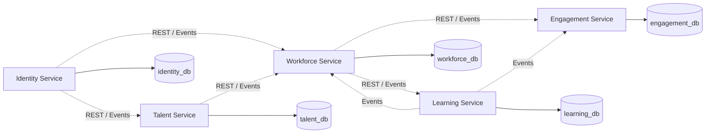

# Document Information

**Document:** Database Ownership Diagram  
**Project:** WorkSphere AI  
**Version:** 1.0  
**Status:** Draft  
**Author:** Oussama Ksantini  
**Last Updated:** 2026-07-11

---

# Database Ownership Diagram

## Purpose

This document defines which service owns each database and business entity.

The main rule is:

> Every business entity has one owning service and one source of truth.

No service may directly access another service's database.

---

# Ownership Diagram



---

# Identity Service Ownership

## Database

```text
identity_db
```

## Owned Entities

- User
- Role
- Permission
- UserRole
- RolePermission
- RefreshToken
- VerificationToken
- PasswordResetToken
- LoginAttempt
- Session
- AccountAuditRecord

## Source of Truth

The Identity Service is the source of truth for:

- User identity
- Authentication credentials
- Account status
- Roles
- Permissions
- Security state

## External References

The Identity Service may store:

- tenant_id
- user_id
- company_id

It does not own employee, candidate, department, or recruitment data.

---

# Talent Service Ownership

## Database

```text
talent_db
```

## Owned Entities

- CandidateProfile
- Resume
- JobOpening
- JobSkill
- Application
- ApplicationStatusHistory
- Interview
- InterviewParticipant
- InterviewFeedback
- Offer
- OfferStatusHistory

## Source of Truth

The Talent Service is the source of truth for:

- Candidates
- Jobs
- Applications
- Interviews
- Offers
- Recruitment pipeline

## External References

The Talent Service may store identifiers such as:

- user_id
- company_id
- department_id
- position_id
- hiring_manager_id

These are references only.

The Talent Service must not create local copies of entire employee or company entities.

---

# Workforce Service Ownership

## Database

```text
workforce_db
```

## Owned Entities

- Company
- Office
- Department
- Team
- Position
- EmployeeProfile
- EmployeeNumber
- ManagerAssignment
- TeamMembership
- EmploymentStatusHistory
- OnboardingChecklist
- OnboardingTask
- Recognition
- EmployeePoints
- EmployeeOfMonth
- CompanySettings

## Source of Truth

The Workforce Service is the source of truth for:

- Company structure
- Employees
- Departments
- Teams
- Positions
- Manager relationships
- Onboarding
- Recognition scoring for the MVP

## External References

The Workforce Service may store:

- user_id
- source_offer_id
- certificate_id
- quiz_id

The `source_offer_id` must be unique to prevent duplicate employee provisioning.

---

# Learning Service Ownership

## Database

```text
learning_db
```

## Owned Entities

- LearningPath
- LearningPathAssignment
- Course
- CourseModule
- LearningResource
- Quiz
- Question
- AnswerOption
- QuizAssignment
- QuizAttempt
- QuizResponse
- Certificate
- CertificateVerificationRecord

## Source of Truth

The Learning Service is the source of truth for:

- Learning content
- Quizzes
- Questions
- Attempts
- Scores
- Certificates
- Learning progress

## External References

The Learning Service may store:

- employee_id
- company_id
- assigned_by_user_id

Employee details remain owned by the Workforce Service.

---

# Engagement Service Ownership

## Database

```text
engagement_db
```

## Owned Entities

- ForumCategory
- Post
- Comment
- Reaction
- Announcement
- Notification
- NotificationPreference
- NotificationDelivery
- BadgeDisplay
- LeaderboardProjection
- EmployeeOfMonthPublication

## Source of Truth

The Engagement Service is the source of truth for:

- Forum content
- Announcements
- In-app notifications
- Engagement-facing projections
- Published recognition results

## External References

The Engagement Service may store:

- user_id
- employee_id
- company_id
- recognition_id
- certificate_id

It does not own employee profiles or quiz results.

---

# Cross-Service Reference Rules

Cross-service references use UUID values.

Example:

```text
learning_db.quiz_attempt.employee_id
```

This references an employee owned by the Workforce Service.

There is no database-level foreign key across services.

Validation occurs through:

- REST APIs
- Cached reference data
- Domain events

---

# Allowed Relationships

## Within One Service

Database foreign keys are allowed.

Example:

```text
Quiz
  ↓
Question
  ↓
AnswerOption
```

All entities belong to the Learning Service.

---

# Prohibited Relationships

The following are prohibited:

```text
learning_db.quiz_attempt
    FOREIGN KEY
workforce_db.employee_profile
```

Also prohibited:

- Cross-database joins
- Shared schemas
- Shared business tables
- Direct SQL queries across services
- Shared JPA entities

---

# Data Duplication

Limited data duplication is allowed only for:

- Read performance
- Search indexes
- Analytics projections
- Display snapshots
- Event-driven read models

Example:

The Engagement Service may store an employee display name snapshot for a published announcement.

The Workforce Service remains the source of truth.

---

# Data Change Propagation

When source data changes, the owning service publishes an event.

Example:

```text
EmployeeProfileUpdated
        ↓
Engagement Service updates display projection
        ↓
Analytics Service updates reporting model
```

Consumers must handle events idempotently.

---

# Tenant Isolation

All tenant-scoped business tables should contain:

```text
tenant_id
```

or:

```text
company_id
```

Every query must include tenant filtering.

Example:

```sql
SELECT *
FROM employee_profile
WHERE company_id = :companyId
  AND id = :employeeId;
```

A valid ID alone is not sufficient for authorization.

---

# Primary Key Strategy

All business entities use UUID primary keys.

Example:

```text
id UUID
```

Benefits:

- Safe across distributed services
- No coordination required
- Suitable for events
- Easier data migration
- Better tenant isolation

---

# Auditing Fields

Most business tables should include:

```text
created_at
created_by
updated_at
updated_by
```

Where appropriate:

```text
deleted_at
deleted_by
version
```

---

# Soft Deletion

Soft deletion should be used for important business records when historical integrity is required.

Examples:

- Employees
- Jobs
- Applications
- Courses
- Posts

Not every technical record requires soft deletion.

Tokens and transient records may be deleted permanently.

---

# Migration Ownership

Each service owns its Flyway migrations.

Example:

```text
identity-service/
  src/main/resources/db/migration/

talent-service/
  src/main/resources/db/migration/

workforce-service/
  src/main/resources/db/migration/
```

A service must never execute migrations against another service's database.

---

# Transaction Boundaries

Transactions are local to one service.

Example:

```text
Talent Service transaction:
- update offer status
- insert offer history
- insert outbox event
```

Cross-service workflows use:

- Kafka events
- Eventual consistency
- Idempotent consumers
- Compensation where necessary

---

# Future Databases

Future services may introduce:

```text
work_management_db
attendance_db
compensation_db
calendar_db
collaboration_db
analytics_db
integration_db
billing_db
```

These databases must follow the same ownership rules.

---

# Summary

| Service | Database | Main Ownership |
|---|---|---|
| Identity Service | identity_db | Users, authentication, roles, permissions |
| Talent Service | talent_db | Jobs, candidates, applications, interviews, offers |
| Workforce Service | workforce_db | Companies, employees, teams, onboarding, recognition |
| Learning Service | learning_db | Learning paths, quizzes, attempts, certificates |
| Engagement Service | engagement_db | Forum, announcements, notifications, publications |